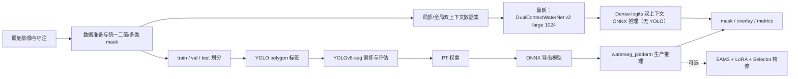
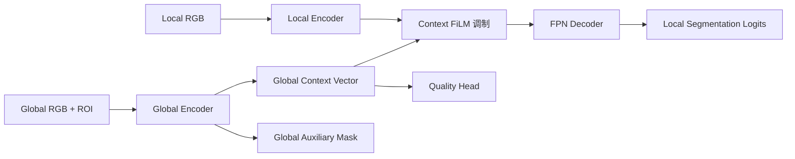
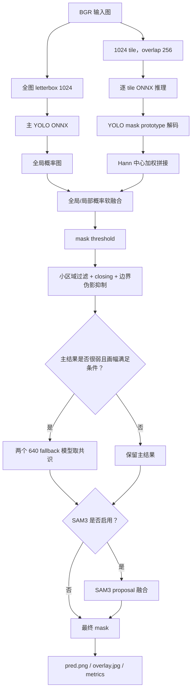

# Water Segment 项目结构与逻辑说明

> 初次整理：2026-08-06；最新模型补充：2026-08-13  
> 项目根目录：`D:\project\water_segment`  
> 本文基于当前仓库代码与配置整理。`data/`、`runs/`、`outputs/`、模型权重和第三方工具缓存体量很大，因此目录树按职责归纳，而不是逐文件罗列。

## 1. 项目定位

这是一个面向道路积水、洪水和卫星水体的分割工程，已经从最初的 YOLOv8-seg 训练脚本扩展成四条主线。**按仓库时间线，最新模型不是 YOLO，而是 2026-08-03 完成训练与 ONNX 导出的 `DualContextWaterNet v2 large 1024`。**

1. **YOLO 数据与训练线**：准备 FloodNet、GF-FloodNet、Sen2GF3 等数据，划分数据集、转换 YOLO 分割标签、训练、评估和困难样本微调。
2. **纯 ONNX 推理平台线**：不用 PyTorch/Ultralytics 执行生产推理，自己实现 letterbox、NMS、YOLOv8 mask 解码、切片拼接、级联兜底和结果保存。
3. **SAM3 精修线**：以 YOLO mask 为先验生成 box/point/text proposal，通过 SAM3、LoRA 和 proposal selector 做可选边界精修或召回扩展。
4. **双上下文卫星模型线（最新模型）**：局部影像与全局影像/ROI 双路输入，使用双编码器、FiLM 和 FPN 解码器处理大幅卫星影像中的水体分割；不使用 YOLO 检测头、anchor/NMS 或 prototype mask。

整体关系如下：



### 1.1 核心分割指标

所有指标均按二值像素混淆矩阵计算，其中 `TP` 为正确识别的水体像素，`FP` 为误报水体像素，`FN` 为漏检水体像素：

| 指标 | 公式 | 含义 |
|---|---|---|
| Precision | `TP / (TP + FP)` | 预测为水体的像素中有多少是真的；越高表示误报越少 |
| Recall | `TP / (TP + FN)` | 真实水体像素中有多少被找到；越高表示漏检越少 |
| IoU | `TP / (TP + FP + FN)` | 预测区域和真实区域的交并比，是本项目主要的区域重合指标 |
| Dice / F1 | `2TP / (2TP + FP + FN)` | 更强调预测与 GT 的整体重合；二分类像素统计下 Dice 与 F1 等价 |

IoU 与 Dice 可互相换算：`Dice = 2 × IoU / (1 + IoU)`。因此同一统计口径下不应把 Dice 的较大数值误解为模型额外提升。

### 1.2 最新模型：DualContextWaterNet v2 large 1024

最新模型的完整标识与产物：

| 项目 | 当前值 |
|---|---|
| 模型类型 | 双输入 dense semantic segmentation，**不使用 YOLO** |
| PyTorch checkpoint | `runs/dual_context_water/v2_large_1024_finetune/best.pt` |
| 最佳 epoch | 10（训练共执行 100 epochs，按最佳 Dice 保存） |
| ONNX | `onnx/dual_context_water_v2_large_1024_candidate.onnx` |
| ONNX SHA256 | `60AE3651F3F556247640A604CED021638A58A13AE4B576A8704989DB3761B157` |
| ONNX 大小 | 339,409,636 bytes，约 323.7 MiB |
| 训练配置 | `configs/dual_context_water_v2_large_1024_finetune.yaml` |
| 本地输入 | `local_image: (1, 3, 1024, 1024)` |
| 全局输入 | `global_context: (1, 4, 512, 512)`，RGB + 当前 tile 的 ROI mask |
| 输出 | `water_logits (1,1,1024,1024)`、`global_logits (1,1,512,512)`、`quality_logits (1,1)` |

#### 模型结构

```text
1024×1024 local RGB
  → ConvNeXt-Small local encoder
  → 4-level feature pyramid
                              ┐
512×512 global RGB + ROI mask │
  → ConvNeXt-Tiny global encoder
  → global average + ROI average context vector
  → ContextFiLM 调制 local 多尺度特征
                              ┘
  → 256-channel GroupNorm FPN decoder
  → dense water logits
```

它与 YOLO 路线的根本区别是：每个像素直接输出水体 logit，不先预测检测框，也不经过置信度筛选、NMS、mask coefficient × prototype 解码。大图推理时，每个 1024 tile 都同时看到整幅图缩放后的全局 RGB 和该 tile 在全图中的 ROI 位置，因此局部细节与全局地理上下文可以共同决策。

#### 数据与训练

- 训练 manifest：`data/satellite_adaptation_1024_v1/combined_train.csv`，共 **2830** 条记录，其中 base 2770、satellite 60。
- 训练时通过 `WeightedRandomSampler` 将卫星样本目标占比提高到 **45%**，不是简单按原始 60/2830 比例采样。
- 验证 manifest：`data/satellite_adaptation_1024_v1/satellite_val.csv`，共 **220** 个卫星 tile。
- 损失由 local segmentation、global auxiliary segmentation、quality classification、Tversky 和 boundary loss 组成。
- 从 `v2_large_convnext_small_tiny/best.pt` 初始化，再以 1024 卫星数据微调。

#### 最新验证指标

220 个卫星验证 tile、阈值 `sigmoid(logits) >= 0.5` 的 micro 结果：

| IoU | Dice/F1 | Precision | Recall |
|---:|---:|---:|---:|
| **0.6144** | **0.7612** | **0.8288** | **0.7038** |

相对初始化 checkpoint 在其记录指标中的变化为：IoU `0.5523 → 0.6144`（+6.21 pp）、Dice `0.7116 → 0.7612`（+4.96 pp）、Precision `0.6200 → 0.8288`（+20.87 pp），Recall `0.8350 → 0.7038`（-13.12 pp）。这说明最新微调明显压低了卫星场景误报，但决策也更保守；若强调洪水召回，需要继续校准阈值或损失权重。

来源：checkpoint 内嵌 `metrics/config`、`runs/dual_context_water/v2_large_1024_finetune/watch.out.log` 与 `train.out.log`。

#### 最新 ONNX 推理方式与延迟抽测

`dual_context_water/inference.py` 对大图执行：1024 tile、256 overlap、Hann 加权拼接，然后用 low=`0.40`、high=`0.65` 的 hysteresis 生成连通 mask。这里的双阈值生产推理口径与上方验证脚本的固定 `0.5` 阈值不同。

2026-08-13 对 `ida_0000.jpg`（1024×1024、1 tile）进行 1 次预热后 5 次 CUDA 抽测：平均 **195.1 ms**，P50 **192.9 ms**，范围 `187.2～207.6 ms`。这是单样本本机抽测，不是完整 220 张 latency benchmark；大图耗时近似随 tile 数线性增加。

#### 当前集成状态

- 最新 checkpoint 和 ONNX 已成功生成并通过 ONNX shape 验证，状态是 **latest candidate**。
- Python 推理入口已经支持：`dual_context_water/inference.py`、`scripts/29_predict_dual_context_onnx.py`。
- .NET 已有 `DualContextOnnxSegmentationPredictor`，但当前 `platform_prediction_yolo_dotnet_export/configs/dual_context.json` 仍指向较早的 `dual_context_water_satellite_adapt_ian_to_ida_fp32.onnx`，**尚未切换到最新 v2 large 1024 candidate**。
- 因此“仓库最新模型”和“现有 .NET 交付包默认模型”目前不是同一个文件；正式发布前还需要复制最新 ONNX、更新配置并重新做 Python/.NET parity 与 latency 验证。

### 1.3 YOLO/SAM3 并行基线结果

为了评估历史道路/洪水路线，项目仍保留 60 张 FloodNet test split 的 YOLO-only ONNX 基线。这里使用 **micro** 口径，即先汇总全部图像的 TP/FP/FN，再计算指标：

| 测试集/模式 | IoU | Dice/F1 | Precision | Recall |
|---|---:|---:|---:|---:|
| FloodNet test 60，YOLO-only | **0.6645** | **0.7984** | **0.8124** | **0.7849** |

来源：`runs/final_test/sam3_lora_selector_frozen_rerun_validated/summary.json`。该数值适合描述当前 ONNX + SAM3 对比基线；它与下面 838 张道路积水 test 集不是同一数据口径，不能直接横向比较。

### 1.4 Hard sample 前后变化

838 张道路积水独立 test 集上的结果：

| 模型 | IoU | Dice/F1 | Precision | Recall | FP 图片 | FN 图片 |
|---|---:|---:|---:|---:|---:|---:|
| Base，hard sample 前 | **0.8539** | **0.9212** | 0.9172 | **0.9253** | **4** | 8 |
| Balanced freeze | 0.7312 | 0.8447 | 0.9225 | 0.7790 | 0 | 80 |
| Recall hard-sample，最终候选 | 0.8415 | 0.9139 | **0.9242** | 0.9038 | 7 | **3** |

从 Base 到 Recall hard-sample 的变化为：

- FN 图片由 `8 → 3`，减少 **62.5%**，这是 hard-sample 训练最明确的收益。
- Precision 由 `0.9172 → 0.9242`，提升 **0.70 个百分点**。
- 但 Recall 下降 **2.15 个百分点**，IoU 下降 **1.24 个百分点**，Dice 下降 **0.73 个百分点**；FP 图片由 `4 → 7`。
- 因此不能简单写成“hard sample 后所有指标提升”。更准确的结论是：**困难样本策略显著减少了完全漏检图片，但牺牲了一部分像素召回和总体 IoU；Base 仍是该 test 集上最稳定的综合模型。**

来源：`runs/eval_yolov8m_b8_3_test/summary_test.csv`、`runs/eval_yolov8m_hard_balanced_freeze_test/summary_test.csv`、`runs/eval_yolov8m_hard_recall_freeze_test/summary_test.csv`。

### 1.5 1024 tile 与 full-image

两条路径的目的不同：full-image 把整张图 letterbox 到 `1024×1024`，保留全局上下文但压缩大图细节；tile 将大图切成 `1024×1024` 局部块并以 overlap 拼接，保留细节但推理次数随 tile 数增长。

| 对比场景 | Full-image | 1024 tile | 结论 |
|---|---:|---:|---|
| 图像不超过一个 tile | 1 次推理 | 1 个 tile | 测试中输出一致；有前景样本的 mask IoU 为 `1.0` |
| `1366×1025` 历史诊断样例 | `1.939 s` | overlap 256、4 tiles：`8.954 s` | 两者 mask IoU=`1.0`，该样例没有获得精度收益，只增加耗时 |
| `3000×4000` 大图诊断 | 全图强压缩 | 12 tiles | full/tile 输出 IoU 曾为 `0.5493`、`0.6417`，说明两种路径会产生实质差异 |

注意：大图诊断样例没有统一 GT，因此 `0.5493/0.6417` 是 **full 与 tile 两份预测之间的一致性**，不是相对真实标注的模型 IoU，不能据此宣称 tile 必然更准。当前工程选择全局概率 + tile 概率软融合，是在全局语义、局部细节和接缝稳定性之间折中。

来源：`runs/platform_test/test_image_compare/metrics.json`、`runs/systematic_test_results.json` 和 `tests/test_tiling.py`。该表属于 YOLO 平台诊断；历史结果包含早期拼接实现，当前 YOLO 实现以 `waterseg_platform/pipeline.py` 为准。最新 DualContext 的 tile 逻辑应以 `dual_context_water/inference.py` 为准。

### 1.6 ONNX latency

仓库结果与本次抽测可复用的三组延迟记录如下：

| 基准 | 平均延迟 | P50 | P95 | 说明 |
|---|---:|---:|---:|---|
| **最新 DualContext v2 large 1024**，单 tile 抽测 | **195.1 ms/图** | 192.9 ms | 未做正式 P95 | CUDA，1 次预热后 5 次；单样本抽测 |
| 当前 1024 YOLO-only，FloodNet 60 张 | **82.5 ms/图** | 75.4 ms | 90.5 ms | Session 复用，配置 provider 顺序为 CUDA → CPU；结果文件未单独固化实际 active provider |
| 历史 ONNX CPU，GF-FloodNet 200 张 | 294.2 ms/图 | 294.6 ms | 312.0 ms | `CPUExecutionProvider`，历史单图/704 parity 基准，不代表当前 1024 大图 tiled 延迟 |

1024 tiled 大图总耗时不能用一个固定数字表示。YOLO 路线近似包含 `1 次全图 coarse pass + N 次 tile pass`；DualContext 路线对每个 local tile 同时构造 global+ROI 输入。两者都还会叠加拼接与保存耗时。SAM3 不属于纯 ONNX latency，见 1.8。

来源：`tmp/dual_context_v2_large_1024_latency_20260813.json`、`runs/final_test/sam3_lora_selector_frozen_rerun_validated/yolo_only_metrics.csv` 与 `runs/onnx_platform_200/metrics.csv`。

最新 DualContext candidate 还没有完成 Python/.NET 全集 parity，因此下面已有的误差数据主要属于 YOLO 解码路线，不能套用到最新模型。

### 1.7 Python/.NET 输出误差

需要区分两种 parity：

| 对比 | 现有证据 | 最大误差/差异 |
|---|---|---|
| Python ONNX vs Ultralytics `.pt` | 200 张 GF-FloodNet、相同 704 输入和阈值 | `max |ΔIoU| = 0.066`；P99 `|ΔIoU| = 0.047`；平均 `|ΔIoU| = 0.0035` |
| Python ONNX vs .NET ONNX | 2026-08-13 同模型 SHA256、同参数、同一张 `256×256` 样例 spot check | mask IoU=`0.9684`；2039 个像素不同，占 `3.1113%`；二值像素最大绝对误差=`1` |

第二行只是受控单样本检查，**当前仓库尚未保存 Python/.NET 全测试集 parity 报告，所以不能把它宣称为整个项目的“最大输出误差”**。若交付材料必须给出项目级最大值，应固定至少 60/200 张输入、完全一致的阈值/后处理/拼接方式，同时报告 `max mismatch ratio`、`min mask IoU` 和 `max |ΔIoU vs GT|`。当前 Python 与 .NET 的 tile 权重、边界抑制或交付配置存在差异时，也必须先对齐后再比较。

Python/Ultralytics 来源：`waterseg_platform/PARITY.md`。本次 Python/.NET spot check 输出保存在 `tmp/parity_python_dotnet_20260813/`。

### 1.8 SAM3 提升与代价

采用冻结的 SAM3 LoRA + proposal selector 后，在同一 60 张 FloodNet test split 上：

| 模式 | IoU | Dice/F1 | Precision | Recall | 平均耗时 |
|---|---:|---:|---:|---:|---:|
| YOLO-only | 0.6645 | 0.7984 | **0.8124** | 0.7849 | **82.5 ms** |
| YOLO + SAM3 LoRA + Selector | **0.7297** | **0.8437** | 0.8096 | **0.8808** | 3820.3 ms |
| 变化 | **+6.52 pp** | **+4.53 pp** | -0.28 pp | **+9.59 pp** | 约 **46.3×** |

同时，平均 boundary F1 从 `0.2138 → 0.2482`，提升 `3.44` 个百分点；平均漏检面积比例从 `0.02129 → 0.01179`，下降约 `44.6%`。代价是平均误报面积比例从 `0.01793 → 0.02049`，且单图平均耗时增加到约 `3.82 s`，平均峰值 GPU 显存约 `4111 MB`。

结论：**经过 LoRA 和 selector 的 SAM3 版本确实提高了 IoU、Dice 和召回，尤其能补水体漏检与边界；但 Precision 略降且延迟大幅增加，因此生产默认仍保留 YOLO-only，SAM3 更适合作为高质量/离线精修选项。**

来源：`runs/final_test/sam3_lora_selector_frozen_rerun_validated/summary.json`。这组结果优先于早期未使用最终 LoRA/selector 的 conservative/balanced/open 实验结论。

## 2. 顶层目录结构

```text
water_segment/
├─ configs/                         # 数据集、训练、ONNX 平台、SAM3、双上下文配置
├─ data/                            # 原始、处理中间态、训练/验证/测试数据和清单
├─ src/                             # 数据、mask、指标、划分、可视化等通用基础函数
├─ scripts/                         # 从数据准备到训练、评估、导出、下载的可执行脚本
├─ waterseg_platform/               # 纯 Python/NumPy/OpenCV 的 ONNX 生产推理平台
├─ training/sam3_lora/              # SAM3 LoRA 与 proposal selector 训练实现
├─ dual_context_water/              # 双上下文卫星水体模型、数据集和 ONNX 推理
├─ tests/                           # 数据处理、平台、切片、SAM3 等自动化测试
├─ onnx/                            # YOLO 与双上下文模型的 ONNX 文件
├─ runs/                            # 训练、评估、推理、调试结果
├─ outputs/                         # 预览、演示文稿、打包等派生产物
├─ docs/                            # 技术说明、误差分析、设计方案和交付文档
├─ deliverables/                    # 对外交付资料和影像包
├─ platform_prediction_project/     # 较完整的 .NET 迁移/实验工程副本
├─ platform_prediction_dotnet_export/      # .NET 导出包副本
├─ platform_prediction_yolo_dotnet_export/ # YOLO-only .NET 交付包
├─ tools/                           # 外部工具及其缓存，如 GEHistoricalImagery
├─ training_set/                    # 早期/原始训练集实体文件
├─ *.pt                             # YOLO 基础权重或本地训练权重
├─ requirements.txt                 # 基础 Python 依赖
├─ README.md                        # 初始 YOLOv8 训练流程说明
└─ run_pipeline_example.sh          # 早期端到端命令示例
```

### 2.1 哪些是源代码，哪些是大文件产物

| 类型 | 主要目录/文件 | 是否应重点阅读 |
|---|---|---:|
| 核心源代码 | `src/`、`waterseg_platform/`、`dual_context_water/`、`training/` | 是 |
| 流程入口 | `scripts/` | 是 |
| 行为配置 | `configs/` | 是 |
| 自动化验证 | `tests/` | 是 |
| 数据与缓存 | `data/`、`training_set/`、`tools/**/cache/` | 按需 |
| 模型与结果 | `*.pt`、`onnx/`、`runs/`、`outputs/` | 按需 |
| 打包/交付副本 | `platform_prediction_*`、`deliverables/`、`*.zip` | 交付时阅读 |

## 3. 核心代码分层

### 3.1 `src/`：共享基础层

该目录不负责完整业务编排，而是给训练脚本和推理平台复用。

| 文件 | 职责 |
|---|---|
| `dataset_utils.py` | 匹配 image/mask、读取普通图与 TIFF、读取二值/多类 mask、统计前景面积、推断分组 ID、复制文件和写 YAML |
| `mask_utils.py` | 小连通域过滤、mask 转 polygon、YOLO 分割标签读写、polygon 回填 mask、形态学后处理 |
| `metrics.py` | 像素级 TP/FP/FN/TN、Precision、Recall、F1、IoU、Dice 及宏/微平均 |
| `split_utils.py` | 分层划分 train/val/test，并支持分组避免同源影像泄漏 |
| `visualization.py` | mask 叠加、轮廓、GT/预测误差图和多面板保存 |
| `yolo_utils.py` | 读取训练 YAML，并将配置传给 `ultralytics.YOLO.train()` |

依赖方向应保持为：

```text
scripts/ ───────────────┐
                        ├──> src/
waterseg_platform/ ─────┘
```

`waterseg_platform/image_io.py`、`metrics.py`、`visualization.py` 是对 `src/` 对应能力的薄封装，目的是统一平台侧 import 路径。

### 3.2 `waterseg_platform/`：生产推理与业务编排层

| 文件 | 核心职责 |
|---|---|
| `config.py` | `PlatformConfig` 数据类、YAML 加载/导出、参数合法性检查 |
| `preprocessing.py` | letterbox、坐标正反变换、BGR/RGB → NCHW float32 |
| `engine.py` | 延迟创建 ONNX Runtime Session、CUDA/CPU provider 回退、执行模型、单图预测 |
| `postprocessing.py` | 分离 box/class/mask coefficient、NMS、prototype mask 解码、映射回原图 |
| `tiling.py` | 生成覆盖整图的 tile、Hann/均匀权重图、重叠概率图拼接 |
| `pipeline.py` | `SegmentationService`；串联全图/切片推理、融合、边界抑制、cascade、SAM3、文件与目录输出 |
| `sam3_refinement.py` | 从 YOLO 连通域生成提示，管理 proposal、融合规则、selector 和 worker 客户端 |
| `sam3_worker.py` | 独立 PyTorch 子进程；加载 SAM3/LoRA，执行 text+box、交互点和全局 proposal |
| `sam3_selector.py` | 加载逻辑回归 selector，构造特征向量并判断 proposal 是否接受 |
| `cli.py` | `single`、`dir`、`ui`、`dump-config` 命令行入口 |
| `ui_gradio.py` | 单图和目录推理的 Gradio 页面 |
| `PARITY.md` | 自研 ONNX 解码与 Ultralytics 基线的一致性记录 |

公共入口为：

```python
from waterseg_platform import PlatformConfig, OnnxSegmenter, SegmentationService
```

其中 `SegmentationService` 是业务层首选入口；直接使用 `OnnxSegmenter` 更适合底层测试。

### 3.3 `training/sam3_lora/`：SAM3 训练层

| 文件 | 职责 |
|---|---|
| `data.py` | 构建/校验 JSONL manifest，生成 box 和正负点提示 |
| `lora.py` | 向视觉编码器 Q/V 层注入 LoRA，保存/加载 adapter 和 checkpoint 指纹 |
| `trainer.py` | SAM3 可微前向、匹配分割损失、加权采样、训练和验证 |
| `selector_training.py` | 从缓存 proposal 特征训练逻辑回归 selector，并搜索接受阈值 |

对应脚本顺序是：

```text
15_build_sam3_finetune_manifest.py
  → 16_cache_sam3_proposals.py
  → 17_train_sam3_selector.py
  → 18_train_sam3_lora.py
  → 19_eval_frozen_lora_test.py
```

### 3.4 `dual_context_water/`：最新非 YOLO 卫星模型层

| 文件 | 职责 |
|---|---|
| `dataset.py` | 读取 CSV manifest，返回 local RGB、global RGB+ROI 第四通道、local/global mask、质量目标和样本权重 |
| `model.py` | 双编码器模型；局部特征负责细节，全局分支提取上下文，经 `ContextFiLM` 调制后用 FPN 解码 |
| `inference.py` | ONNX Runtime 切片推理、Hann 加权拼接、sigmoid 和 hysteresis 阈值化 |

当前最新版本是 `v2_large_1024_finetune`：local backbone 为 ConvNeXt-Small，global backbone 为 ConvNeXt-Tiny，decoder 为 256 channels + GroupNorm；对应 ONNX 为 `dual_context_water_v2_large_1024_candidate.onnx`。早期 `convnext_tiny_mobilenetv3`、`satellite_adapt_ian_to_ida_fp32` 仍作为实验/部署历史版本保留。

模型的逻辑结构为：



训练入口是 `scripts/27_train_dual_context.py`，导出和预测分别是 `28_export_dual_context_onnx.py` 与 `29_predict_dual_context_onnx.py`。

## 4. 数据逻辑

### 4.1 经典 YOLO 数据链路

```text
data/<dataset>/raw/images + raw/masks
  → 数据检查与配对
  → processed/images/{train,val,test}
  → processed/masks/{train,val,test}
  → processed/labels/{train,val,test}
  → dataset YAML
  → YOLOv8-seg 训练
```

图像与 mask 以同名 stem 配对。mask 可以来自二值图、指定 RGB 颜色或多类颜色标注；训练前由 `src.dataset_utils` 统一解释，再由 `src.mask_utils` 转成 YOLO polygon 文本。

项目中的主要数据族包括：

| 数据族 | 目录示例 | 用途 |
|---|---|---|
| 基础道路积水 | `data/raw`、`data/processed` | 最初的 waterlogging 训练链路 |
| FloodNet | `data/floodnet*` | 洪水/自然水体、多类或二值增强训练 |
| GF-FloodNet | `data/gf_floodnet*` | 高分/遥感洪水训练与验证 |
| Sen2GF3 | `data/sen2gf3*` | Sentinel-2/GF-3 数据准备、伪标签与联合训练 |
| 困难样本 | `data/hard*` | 低 IoU、误报、漏报样本再训练 |
| 多域/快速模型 | `data/combined_sen2gf3_gf`、`data/water_fast_10h` | 跨域和时限训练 |
| 双上下文 | `data/dual_context_water*` | local/global 成对训练数据 |
| 卫星域适配 | `data/satellite_adaptation*`、`data/processed/flood_cases` | 飓风/洪水卫星场景适配 |
| SAM3 | `data/sam3_finetune` | manifest、proposal 缓存和 LoRA 中间数据 |

### 4.2 防止数据泄漏

`scripts/02_split_dataset.py` 会调用 `src/split_utils.py`，可按文件名前缀推断 group，将同一视频、地区或连续采样源尽量放在同一个 split 中。评估应固定使用独立 `test`，困难样本挖掘优先从 `val` 产生训练样本，避免反复针对 test 调参。

## 5. YOLO 训练脚本的阶段逻辑

### 5.1 基础链路（00～11）

| 阶段 | 脚本 | 作用 |
|---:|---|---|
| 00 | `00_prepare_*_dataset.py` | 将 FloodNet、GF-FloodNet、Sen2GF3 原始格式整理成统一 image/mask |
| 01 | `01_check_dataset.py` | 检查配对、尺寸、前景比例并生成预览/统计 |
| 02 | `02_split_dataset.py` | 划分 train/val/test |
| 03 | `03_convert_mask_to_yolo_seg.py` | mask 转 YOLOv8-seg polygon 标签和 dataset YAML |
| 04 | `04_train_yolov8.py` | 按 `configs/train_*.yaml` 训练 Ultralytics YOLO |
| 05 | `05_eval_test.py` / `05_build_focused_training_lists.py` | 像素指标评估或构建聚焦训练列表 |
| 06 | `06_predict_visualize.py` / `06_eval_multiclass.py` | 可视化预测或多类评估 |
| 07 | `07_hard_sample_mining.py` | 从评估 CSV 挖掘误报/漏报/低 IoU 样本 |
| 08 | `08_finetune_hard_samples.py` | 困难样本微调 |
| 09 | `09_create_balanced_finetune_dataset.py` | 建立更平衡的二阶段训练集 |
| 10 | `10_eval_tp_tn_fp.py` | 按 TP/TN/FP/FN 场景细分评估 |
| 11 | `11_augment_floodnet_binary.py` | 构建增强后的 FloodNet 二值数据集 |

`scripts/11_run_onnx_platform.py` 与编号 11 的数据脚本无直接顺序关系，它只是 ONNX 平台 CLI 的轻量入口。

### 5.2 SAM3、跨域与双上下文扩展（12～35）

- `12`：构建 FloodNet 多尺度裁剪数据。
- `13`～`19`：SAM3 对比、评估、manifest、proposal 缓存、selector、LoRA 和冻结测试。
- `20`～`25`：洪水 vs 自然水体、域适配、flood-only、跨域流水线、快速数据集及 ONNX 导出。
- `26`～`29`：双上下文数据集、训练、ONNX 导出和推理。
- `30`～`31`：卫星域适配数据构建与双上下文评估。
- `32`、`34`、`35`：PowerShell 训练监控/守护脚本。
- `download_*`：从 CDSE、Earth Search、NOAA、USGS、Google Earth 等来源获取影像或 DEM。

## 6. YOLO ONNX 平台推理流程（并行/历史路线）

本节专门描述 `waterseg_platform` 的 YOLO 路线。其默认配置为 `configs/onnx_platform.yaml`，该路线主模型是：

```text
onnx/floodnet_binary_aug_yolov8m_1024.onnx
input size = 1024
```

它不是仓库时间线上最新的 DualContext 模型；最新非 YOLO 路线见 1.2 和 3.4。

### 6.1 大图默认路径



关键点：

- 全图分支提供语义上下文，tile 分支补充局部细节。
- tile 重叠区域使用权重图融合，当前配置为 Hann 权重、边缘权重 `0.3`。
- `tile_weight=0.7`、`global_context_strength=0.5` 控制局部与全局概率贡献。
- 阈值化只在概率融合之后执行，避免先二值化导致接缝断裂。
- 对贴近图像边缘、面积较小且边界接触比例高的连通域执行抑制。
- cascade 只在主模型前景不足、且图像长宽比满足条件时延迟加载，两个 fallback 的交集达到面积阈值才接受。
- SAM3 默认关闭；即使启用，YOLO 仍是检测先验，SAM3 失败时回退到原 YOLO mask。

### 6.2 YOLOv8-seg 解码

`postprocessing.py` 完整展开了 Ultralytics 隐藏的推理数学：

```text
ONNX output0
  → cx,cy,w,h + class score + mask coefficients
  → confidence filter
  → xywh 转 xyxy
  → class-agnostic NMS

ONNX output1
  → mask prototypes
  → coefficients × prototypes
  → sigmoid 概率 mask
  → 按检测框裁剪
  → resize/paste 回原图坐标
```

这部分也是 .NET 移植时最需要保持逐像素一致的模块。

### 6.3 常用入口

```powershell
# 单张图，默认使用 tiled inference
python -m waterseg_platform.cli --image path\to\image.jpg --output_dir runs\demo --save_overlay

# 强制整图单次 letterbox 推理
python -m waterseg_platform.cli --image path\to\image.jpg --no_tiling

# 目录推理并与 GT 计算指标
python -m waterseg_platform.cli dir --image_dir path\to\images --gt_mask_dir path\to\masks --output_dir runs\eval

# 启动 UI
python -m waterseg_platform.cli ui

# 使用脚本包装入口
python scripts\11_run_onnx_platform.py --config configs\onnx_platform.yaml --image path\to\image.jpg
```

## 7. 配置体系

`configs/` 大致分为四组：

| 前缀/文件 | 控制内容 |
|---|---|
| `dataset*.yaml` | YOLO 数据集路径、类别名和 split |
| `train_*.yaml` | YOLO 模型、数据、分辨率、batch、epoch、冻结和增强策略 |
| `onnx_platform*.yaml` | ONNX 模型、阈值、tile、cascade、边界抑制、SAM3 和 provider |
| `dual_context_water*.yaml` | manifest、双编码器、decoder、损失、采样比例和训练资源配置 |

配置优先级通常是：

```text
代码默认值 < YAML 配置 < CLI/函数调用时的显式参数
```

需要特别区分：

- `configs/onnx_platform.yaml` 是 **YOLO 平台路线的默认配置**，SAM3 关闭；它不代表仓库最新模型。
- `onnx_platform_sam3_trial.yaml`、`onnx_platform_sam3_lora_*.yaml` 属于 SAM3 实验/冻结配置。
- `onnx_platform_multiscale_trial.yaml` 是多尺度模型试验配置。
- `dual_context_water_v2_large_1024_finetune.yaml` 是当前最新非 YOLO 双编码器配置，不经过 `SegmentationService`，而是由 `DualContextOnnxPredictor` 推理。

## 8. 模型、运行结果与交付目录

### 8.1 `onnx/`

主要包含：

- 生产 YOLO 二值水体模型：`floodnet_binary_aug_yolov8m_1024.onnx`。
- 多尺度、flood-only、flood-vs-natural-water 和快速模型变体。
- 两个 640 级联 fallback 模型。
- `dual_context_water_*.onnx` 双上下文模型及不同适配版本；其中最新为 `dual_context_water_v2_large_1024_candidate.onnx`。
- `best.onnx`、`best_old_704_nc1.onnx` 等历史一致性模型。

### 8.2 `runs/` 与 `outputs/`

- `runs/segment/` 一类目录通常由 Ultralytics 训练生成。
- `runs/eval*` 保存 CSV 指标、错误样本和可视化。
- `runs/user_image_*`、`runs/*diagnostic*` 多为单图调参和 tile 接缝诊断。
- `runs/dual_context_water/` 保存双上下文 checkpoint 和评估结果。
- `runs/sam3_finetune/` 保存 adapter、selector 和 proposal 结果。
- `outputs/` 偏向演示、预览、PPT 和对外交付前的派生产物。

这些目录不是运行时源代码，不应被其他模块 import。

### 8.3 .NET 工程与副本

`platform_prediction_project/` 包含较完整的 .NET solution、类库、CLI、WinForms、模型、示例和运行结果。核心 C# 层次为：

```text
PredictionConfig
  → Preprocessor
  → OnnxYoloSegmenter
  → YoloV8SegPostprocessor
  → PipelineRunner / PredictionService
  → CLI 或 WinForms
```

`platform_prediction_dotnet_export/` 和 `platform_prediction_yolo_dotnet_export/` 是面向交付的裁剪/冻结副本。修改主逻辑时应先明确哪一份是源头，避免三处代码漂移；通常 Python 的算法真值以 `waterseg_platform/` 为准，C# 对照 Python 进行 parity 验证。

## 9. 测试结构

| 测试文件 | 覆盖范围 |
|---|---|
| `test_preprocessing.py` | letterbox、颜色和 tensor 布局 |
| `test_postprocessing.py` | NMS、prototype mask 解码和后处理 |
| `test_tiling.py` | tile 覆盖、重叠、权重和拼接 |
| `test_platform_config.py` | YAML/数据类默认值与校验 |
| `test_platform_cascade.py` | 弱结果触发与双模型共识 |
| `test_pipeline_parity.py` | 自研平台与基线输出一致性 |
| `test_sam3_refinement.py` | proposal、提示点和融合规则 |
| `test_sam3_finetune.py` | manifest、LoRA、selector 训练组件 |
| `test_prepare_*.py` | GF-FloodNet/Sen2GF3 数据准备 |
| `test_floodnet_*.py` | 二值增强与多尺度裁剪 |
| `test_balanced_dataset.py` | 困难样本平衡数据集 |

建议按风险分层运行：

```powershell
# 纯函数快速测试
pytest tests\test_preprocessing.py tests\test_postprocessing.py tests\test_tiling.py -q

# 平台测试
pytest tests\test_platform_config.py tests\test_platform_cascade.py tests\test_pipeline_parity.py -q

# 全量测试（可能依赖本地模型/环境）
pytest tests -q
```

## 10. 环境与依赖边界

根 `requirements.txt` 主要覆盖 YOLO 训练和基础数据处理：Ultralytics、OpenCV、NumPy、Pandas、scikit-learn、Matplotlib、tqdm、PyYAML、Pillow、tifffile。

不同功能还存在额外依赖边界：

- ONNX 平台需要 `onnxruntime` 或 `onnxruntime-gpu`。
- UI 需要 `gradio`。
- 双上下文训练需要 `torch`、`timm`；推理需要 ONNX Runtime。
- SAM3 worker 需要 PyTorch、SAM3 对应代码/权重以及可选 LoRA adapter。
- Windows 下 ONNX Runtime/OpenCV 与 PyTorch 的原生 DLL 可能冲突，因此 SAM3 默认设计为持久子进程，与主 ONNX 进程隔离。

## 11. 新成员阅读顺序

如果目标是理解生产预测，推荐：

```text
configs/onnx_platform.yaml
  → waterseg_platform/config.py
  → preprocessing.py
  → engine.py
  → postprocessing.py
  → tiling.py
  → pipeline.py
  → cli.py
```

如果目标是重新训练 YOLO，推荐：

```text
README.md
  → scripts/00～04
  → src/dataset_utils.py + mask_utils.py + split_utils.py
  → configs/train_*.yaml
  → scripts/05～10
```

如果目标是 SAM3，推荐：

```text
docs/SAM3_LORA_SELECTOR_RUNBOOK.md
  → scripts/15～19
  → training/sam3_lora/
  → waterseg_platform/sam3_refinement.py
  → waterseg_platform/sam3_worker.py
```

如果目标是卫星大图模型，推荐：

```text
scripts/26_build_dual_context_dataset.py
  → dual_context_water/dataset.py
  → dual_context_water/model.py
  → scripts/27_train_dual_context.py
  → scripts/28_export_dual_context_onnx.py
  → dual_context_water/inference.py
```

## 12. 当前结构中的维护注意点

1. 根 README 仍主要描述早期 YOLOv8 640 流程，而生产平台配置已经发展到 1024、切片软融合、cascade 和可选 SAM3；判断当前行为应以代码与对应 YAML 为准。
2. `waterseg_platform/README.md` 中仍有部分 704/平均拼接的历史描述，当前 `configs/onnx_platform.yaml` 与 `pipeline.py` 实际采用 1024、Hann 加权和全局/局部融合。
3. 数据、权重、运行结果和工具缓存直接放在仓库中，目录非常大；新增代码检索时应排除 `data/`、`runs/`、`outputs/`、`tools/**/cache/`。
4. `platform_prediction_*` 有多份相似 .NET 工程，修改前需要确认主开发版和交付冻结版，修改后用固定样例做 Python/.NET parity。
5. 仓库最新模型是非 YOLO 的 `DualContextWaterNet v2 large 1024`；`waterseg_platform` 的默认配置仍是 YOLO-only。两套入口独立，不能用 YOLO/SAM3 指标代表最新 DualContext 指标。
6. 最新 DualContext ONNX 尚未替换 .NET 交付包 `dual_context.json` 中的旧模型；发布前必须完成模型复制、配置切换和 Python/.NET parity。
7. `tile_size` 必须匹配 ONNX 固定输入尺寸；只改 YAML 而不重新导出模型会被平台拒绝。

---

一句话总结：**当前最新模型是 `dual_context_water/` 下不使用 YOLO 的 DualContextWaterNet v2 large 1024；`waterseg_platform/` 保留 YOLO ONNX + 可选 SAM3 的并行基线与道路积水路线，`scripts/ + src/` 负责数据和训练，`configs/` 决定各路线行为，`data/onnx/runs` 分别承载输入、模型和结果。**
