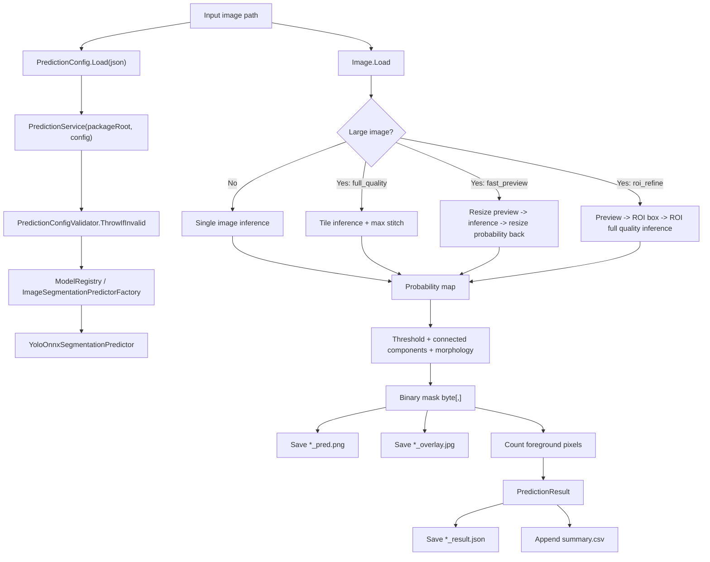

# Image Input To Output Flow

本文档说明一张图片在当前 .NET 水体分割包中，从输入到输出的完整处理流程。当前默认实现为 `yolo-onnx`，但外层入口和配置结构已经为后续模型与处理链变化预留扩展点。

## 1. 总体流程



## 2. 输入

### 2.1 必需输入

调用 `PredictionService.PredictFile` 时需要：

```csharp
var result = service.PredictFile(imagePath, outputDir);
```

| 参数 | 说明 |
|---|---|
| `imagePath` | 输入图片路径。由 ImageSharp 加载为 `Image<Rgb24>`。 |
| `outputDir` | 输出目录。不存在时自动创建。 |
| `saveOverlay` | 是否保存叠加图，默认 `true`。 |

### 2.2 配置输入

配置文件示例：

```text
configs/yolo_only.json
```

关键字段：

| 字段 | 说明 |
|---|---|
| `modelType` | 当前为 `yolo-onnx`。由工厂创建对应 predictor。 |
| `modelPath` | ONNX 模型路径。相对路径基于 `packageRoot`。 |
| `pipeline` | 当前处理链说明，用于 trace 和后续扩展。 |
| `imageSize` | YOLO 输入尺寸，当前默认 1024。 |
| `maskThreshold` | 概率图转二值 mask 的阈值。 |
| `maskBoxExpandRatio` | YOLO mask 采样时检测框扩展比例。 |
| `tiling` | 大图 full_quality 模式下的切片参数。 |
| `largeImage` | 大图处理模式配置。 |

## 3. 服务初始化流程

入口：

```csharp
using var service = new PredictionService(packageRoot, config);
```

内部步骤：

1. 将 `packageRoot` 转为绝对路径。
2. 调用 `PredictionConfigValidator.ThrowIfInvalid(packageRoot, config)`。
3. 通过 `ImageSegmentationPredictorFactory.Create(packageRoot, config)` 创建 predictor。
4. 工厂内部使用 `ModelRegistry` 根据 `modelType` 获取模型构造函数。
5. 创建 `PipelineRunner`，用于生成 pipeline trace。

校验项包括：

- `modelType` 是否为空。
- `modelType` 是否已注册。
- `modelPath` 是否存在。
- 阈值是否在 0 到 1。
- `imageSize`、`maxDetections`、`classCount`、`maskPrototypeCount` 是否有效。
- `tiling.overlapPixels < tiling.tileSize`。
- `largeImage.mode` 是否是支持值。
- pipeline step 名称是否重复。

## 4. 图片加载

`PredictionService.PredictFile` 内部执行：

```csharp
using var image = Image.Load<Rgb24>(imagePath);
```

加载后会记录：

```text
image.path
image.width
image.height
```

这些信息最终写入 `*_result.json` 的 `Metadata`。

## 5. 模型分支选择

当前默认 predictor：

```csharp
YoloOnnxSegmentationPredictor
```

它实现：

```csharp
IImageSegmentationPredictor
```

返回：

```csharp
SegmentationPrediction
```

其中包含：

| 字段 | 说明 |
|---|---|
| `Mask` | 二值 mask，`byte[,]`，维度 `[height, width]`。 |
| `Probability` | 概率图，`float[,]`，维度 `[height, width]`。 |
| `ModelType` | 当前为 `yolo-onnx`。 |
| `Metadata` | 大图模式、tile 数量、ROI 信息等。 |

## 6. 大图处理逻辑

判断条件：

```csharp
Math.Max(image.Width, image.Height) > config.Tiling.TileSize
```

若不满足，则直接单图推理：

```text
largeImage.mode = single_image
tile.count = 1
```

若满足，则根据：

```json
{
  "largeImage": {
    "mode": "full_quality"
  }
}
```

选择处理模式。

### 6.1 full_quality

默认模式。

流程：

1. 按 `tiling.tileSize` 切片。
2. 按 `tiling.overlapPixels` 设置重叠区。
3. 每个 tile 单独推理。
4. 将 tile 概率图拼回原图。
5. 重叠区域取最大概率值。

默认参数：

```text
tileSize = 1024
overlapPixels = 256
step = 768
```

拼接逻辑：

```csharp
full[y, x] = Math.Max(full[y, x], tileProb[y, x]);
```

特点：

- 保持当前最高质量路径。
- 对超大图耗时较长。

### 6.2 fast_preview

快速预览模式。

流程：

1. 将大图最长边缩放到 `largeImage.fastPreviewMaxSide`。
2. 对缩放图推理。
3. 将概率图双线性放大回原图尺寸。
4. 后续仍走统一 mask 后处理。

特点：

- 速度快。
- 适合预览、预筛。
- 不能替代精细结果。

### 6.3 roi_refine

ROI 精推模式。

流程：

1. 先执行 `fast_preview` 获得粗概率图。
2. 使用 `largeImage.roiCoarseThreshold` 找候选区域 bounding box。
3. 使用 `largeImage.roiPaddingPixels` 扩大 ROI。
4. 对 ROI 执行 full quality 推理。
5. 将 ROI 概率图贴回原图对应位置。
6. 原图其他区域保持 0。

特点：

- 适合目标区域相对集中的大图。
- 如果粗预测没有找到 ROI，则输出空概率图。

## 7. YOLO 单图推理流程

单图或 tile 进入：

```csharp
OnnxYoloSegmenter.PredictProbability(image)
```

### 7.1 Letterbox 预处理

执行：

```csharp
Preprocessor.LetterboxToTensor(image, imageSize)
```

步骤：

1. 按最长边等比例缩放到 `imageSize`。
2. 使用 pad color `(114, 114, 114)` 补成正方形。
3. 生成 `DenseTensor<float>`，形状：

```text
[1, 3, imageSize, imageSize]
```

4. 像素归一化：

```text
R / 255
G / 255
B / 255
```

同时保存 `LetterboxMeta`：

| 字段 | 说明 |
|---|---|
| `Ratio` | 原图到 letterbox 图的缩放比例。 |
| `PadW` | 横向 padding。 |
| `PadH` | 纵向 padding。 |
| `NewW` | 缩放后的宽度。 |
| `NewH` | 缩放后的高度。 |
| `ImageSize` | 模型输入尺寸。 |

### 7.2 ONNX Runtime 推理

执行：

```csharp
_session.Run([input])
```

当前模型要求 YOLOv8-seg 风格输出：

```text
output0: boxes/classes/mask coefficients
output1: mask prototypes
```

如果输出数量或维度不符合预期，会抛出异常。

## 8. YOLO 后处理为概率图

入口：

```csharp
YoloV8SegPostprocessor.DecodeProbability(...)
```

步骤：

1. 遍历 anchors。
2. 过滤低于 `confidenceThreshold` 的检测。
3. 解析 box：

```text
cx, cy, w, h -> x1, y1, x2, y2
```

4. 读取 mask coefficients。
5. 做 NMS，阈值为 `iouThreshold`。
6. 最多保留 `maxDetections`。
7. 对每个 detection：
   - 使用 coefficients 与 prototype mask 加权求和。
   - 经过 sigmoid 得到低分辨率 mask。
   - 按 `maskBoxExpandRatio` 扩大 box。
   - 通过 letterbox 坐标反算回原图坐标。
   - 双线性采样写入原图尺寸 probability canvas。
8. 多个 detection 重叠时取较大概率。

重要修正点：

当前版本不是简单把 mask 拉伸到检测框内，而是按原图像素反算到 letterbox/prototype 坐标采样。这避免了右侧水域被检测框硬切成矩形缺口的问题。

## 9. 概率图转二值 mask

入口：

```csharp
MaskPostprocessor.ThresholdAndClean(...)
```

输入：

```text
float[,] probability
```

输出：

```text
byte[,] mask
```

步骤：

1. 阈值化：

```csharp
mask[y, x] = probability[y, x] >= maskThreshold ? 1 : 0;
```

2. 可选贴边大区域抑制：

```text
suppressLargeBorderComponents
```

当前默认关闭，避免误删真实大水面。

3. 小连通域过滤：

```text
minArea = imageHeight * imageWidth * minAreaRatio
```

4. 可选形态学闭运算：

```text
Dilate -> Erode
```

当前默认开启。

## 10. 输出文件

假设输入：

```text
abc.png
```

输出目录：

```text
outputDir/
```

则生成：

```text
abc_pred.png
abc_overlay.jpg
abc_result.json
summary.csv
```

### 10.1 *_pred.png

二值 mask 图。

内部 mask 取值：

```text
0 = background
1 = foreground
```

保存成 PNG 时：

```text
0 -> 0
1 -> 255
```

### 10.2 *_overlay.jpg

叠加图。

当前前景区域以青色半透明风格叠加到原图：

```text
R = R * 0.55 + 40
G = G * 0.55 + 170
B = B * 0.55 + 255
```

JPEG 保存质量：

```text
Quality = 92
```

### 10.3 *_result.json

标准化单图结果。

包含：

```json
{
  "MaskPath": "...",
  "OverlayPath": "...",
  "MaskArea": 56319,
  "PredAreaRatio": 0.6693885,
  "ModelType": "yolo-onnx",
  "Metadata": {
    "image.path": "...",
    "image.width": "355",
    "image.height": "237",
    "elapsedMilliseconds": "...",
    "largeImage.mode": "single_image",
    "tile.count": "1",
    "pipeline.type": "segmentation",
    "pipeline.enabledStepCount": "4",
    "pipeline.enabledSteps": "preprocess:letterbox>inference:yolo-onnx>postprocess:binary-mask>output:mask-overlay-files"
  }
}
```

### 10.4 summary.csv

输出目录内追加式汇总文件。

字段：

```text
timestamp
modelType
maskArea
predAreaRatio
maskPath
overlayPath
imagePath
width
height
elapsedMilliseconds
largeImageMode
tileCount
```

## 11. 返回对象

`PredictFile` 返回：

```csharp
PredictionResult
```

字段：

| 字段 | 说明 |
|---|---|
| `MaskPath` | mask 文件路径。 |
| `OverlayPath` | overlay 文件路径。 |
| `MaskArea` | 前景像素数。 |
| `PredAreaRatio` | 前景像素占整图比例。 |
| `ModelType` | 当前模型类型。 |
| `ResultJsonPath` | `*_result.json` 路径。 |
| `SummaryCsvPath` | `summary.csv` 路径。 |
| `Metadata` | 诊断信息。 |

## 12. 当前默认配置对应的流程

默认 `yolo_only.json` 表达的当前链路：

```text
preprocess: letterbox
inference: yolo-onnx
postprocess: binary-mask
output: mask-overlay-files
```

关键默认参数：

```text
modelType = yolo-onnx
imageSize = 1024
confidenceThreshold = 0.25
iouThreshold = 0.5
maskThreshold = 0.65
maskBoxExpandRatio = 0.5
minAreaRatio = 0.0005
morphClose = true
largeImage.mode = full_quality
tiling.tileSize = 1024
tiling.overlapPixels = 256
```

## 13. 示例结果

测试图片：

```text
C:\Users\17473\Desktop\微信图片_20260602144629_184_4.png
```

当前默认配置输出：

```text
maskArea=56319
predAreaRatio=0.669388
modelType=yolo-onnx
```

输出路径示例：

```text
*_pred.png
*_overlay.jpg
*_result.json
summary.csv
```

## 14. 后续处理链变化时的约定

后续如果模型或处理链改变，例如：

```text
resize -> coarse model -> ROI refine -> postprocess -> output
```

应保持外层入口不变：

```csharp
using var service = new PredictionService(packageRoot, config);
var result = service.PredictFile(imagePath, outputDir);
```

变化应体现在：

- 新的 `modelType`。
- 新的 `IImageSegmentationPredictor` 实现。
- `ModelRegistry.Register(...)` 注册。
- JSON 中的 `pipeline.steps[*]` 与 options。

业务侧不应写死模型参数、阈值、大图模式或后处理步骤。
